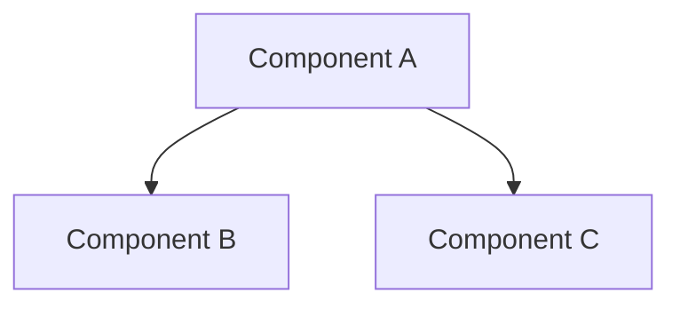

# Architecture Document Templates

> **Version**: 1.0.0
> **Created**: 2025-12-27
> **Status**: production

## Overview

标准化的架构文档模板，确保文档结构一致、AI 友好、人类可读。

## Template Format Standard (v4.5)

所有架构文档应遵循以下格式标准：

### Required Sections

```markdown
## AI Quick Index (AI快速索引)
- **Document Type**: [type]
- **Version**: X.Y.Z
- **Created**: YYYY-MM-DDTHH:mm:ss+TZ
- **Updated**: YYYY-MM-DDTHH:mm:ss+TZ
- **Author**: [team/person]
- **Status**: [draft/production/deprecated]

## Core Value (核心价值)
[30 characters or less describing unique value]

[Main content sections...]

## Version History (版本历史)
| Version | Date | Type | Changes |
```

---

## L0 Index Template

For module-level index documents (`ARCHITECTURE_DOCS_INDEX.md`).

```markdown
# [Module Name] Architecture Documentation Index

## AI Quick Index
- **Document Type**: Architecture Index
- **Module Type**: [Mobile/Backend/Frontend/Shared]
- **Version**: X.Y.Z
- **Created**: YYYY-MM-DDTHH:mm:ss+08:00
- **Updated**: YYYY-MM-DDTHH:mm:ss+08:00
- **Author**: [Team]
- **Status**: production
- **Document Count**: N documents

## Core Value
[Module's primary purpose in ≤30 chars]

## Document Hierarchy

### L1 Components
| Component | Description | Files | Document |
|-----------|-------------|-------|----------|
| [name] | [purpose] | N | [link] |

### L2 Sub-Components
| Component | Parent | Description | Files | Document |
|-----------|--------|-------------|-------|----------|
| [name] | [parent] | [purpose] | N | [link] |

## Quick Navigation
| Task | Go To |
|------|-------|
| Understand overall architecture | [Overview](#overview) |
| Find specific component | [Hierarchy](#document-hierarchy) |
| Check dependencies | [Dependencies](#dependencies) |

## Dependencies


## Statistics
- **Total Files**: N
- **Documented**: N (100%)
- **L1 Components**: N
- **L2 Components**: N

## Version History
| Version | Date | Type | Changes |
|---------|------|------|---------|
| X.Y.Z | YYYY-MM-DD | [type] | [description] |
```

---

## L1 Component Template

For major component documents (≥10 files).

```markdown
# [Component Name] Architecture

## AI Quick Index
- **Document Type**: Component Architecture
- **Module Type**: [Business Logic/API/UI/Data/Test]
- **Core Function**: [one-line description]
- **Key Files**: [3-5 core files]
- **Dependencies**: [key dependencies]
- **Version**: X.Y.Z
- **Created**: YYYY-MM-DDTHH:mm:ss+08:00
- **Updated**: YYYY-MM-DDTHH:mm:ss+08:00
- **Author**: [Team]
- **Status**: production

## Core Value
[Component's unique value in ≤30 chars]

## Quick Navigation
| Sub-Module | Responsibility | Files | Document |
|------------|---------------|-------|----------|
| [name] | [scope] | N | [link] |

## Key Design Decisions
1. **[Decision]** - [Brief rationale]
2. **[Decision]** - [Brief rationale]
3. **[Decision]** - [Brief rationale]

## File Structure
```
component/
├── sub_module_a/    # [purpose]
├── sub_module_b/    # [purpose]
└── shared/          # [purpose]
```

## Dependencies

### Internal
- [Dependency] - [purpose]

### External
- [Package] - [purpose]

## Coverage Statistics
- **Total Files**: N
- **Coverage**: 100%
- **Tech Stack**: [list]

## Version History
| Version | Date | Type | Changes |
|---------|------|------|---------|
```

---

## L2 Sub-Component Template

For sub-component documents (5-10 files).

```markdown
# [Sub-Component Name] Architecture

## AI Quick Index
- **Document Type**: Sub-Component Architecture
- **Module Type**: [specific type]
- **Core Function**: [detailed description]
- **Key Files**: [core files]
- **Dependencies**: [dependencies]
- **Version**: X.Y.Z
- **Created**: YYYY-MM-DDTHH:mm:ss+08:00
- **Updated**: YYYY-MM-DDTHH:mm:ss+08:00
- **Author**: [Team]
- **Status**: production

## Core Value
[Sub-component's value in ≤30 chars]

## File List (100% Coverage Required)

| File | Type | Responsibility | Lines |
|------|------|---------------|-------|
| file_a.dart | Service | [purpose] | N |
| file_b.dart | Model | [purpose] | N |
| file_c.dart | Widget | [purpose] | N |

## Class/Function Overview

### [ClassName]
- **Purpose**: [description]
- **Key Methods**: [list]
- **Dependencies**: [list]

## Data Flow
```
Input → [Process A] → [Process B] → Output
```

## Test Coverage
| Test File | Coverage | Status |
|-----------|----------|--------|
| file_test.dart | 85% | ✅ |

## Version History
| Version | Date | Type | Changes |
|---------|------|------|---------|
```

---

## Metadata Standards

### Version Format

```
X.Y.Z
│ │ └── Patch: Bug fixes, minor updates
│ └──── Minor: New features, non-breaking
└────── Major: Breaking changes, restructuring
```

### Timestamp Format

ISO 8601 with timezone:
```
YYYY-MM-DDTHH:mm:ss+08:00
```

### Status Values

| Status | Meaning |
|--------|---------|
| `draft` | Work in progress |
| `production` | Active and maintained |
| `deprecated` | Scheduled for removal |
| `archived` | No longer maintained |

### Document Types

| Type | Used For |
|------|----------|
| Architecture Index | L0 module index |
| Component Architecture | L1 major component |
| Sub-Component Architecture | L2 sub-component |
| API Documentation | API references |
| Design Document | Design decisions |

## Best Practices

1. **Keep AI Index at top**: Always first section
2. **Core Value ≤30 chars**: Force clarity
3. **100% file coverage**: List all code files in L2
4. **Update timestamps**: Always update on changes
5. **Link to children**: L0→L1→L2 navigation
6. **Use tables**: Prefer tables over prose
