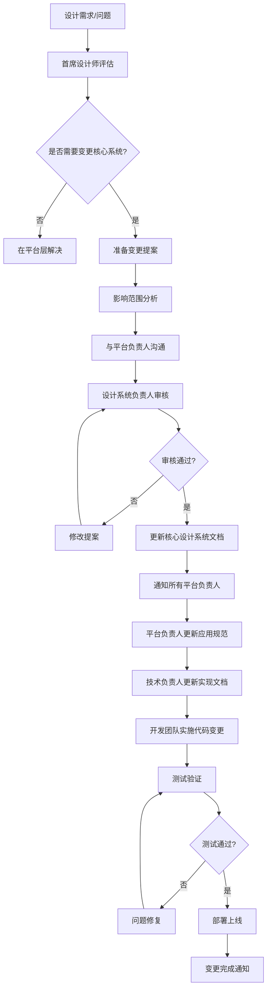
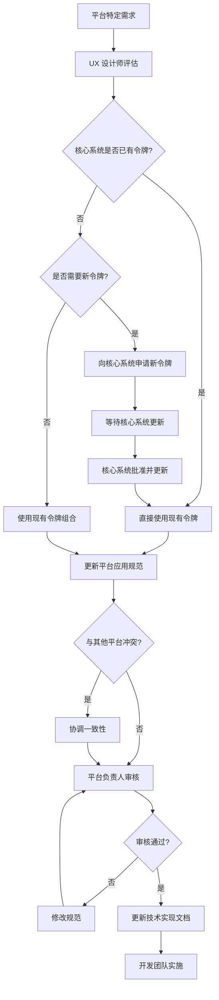
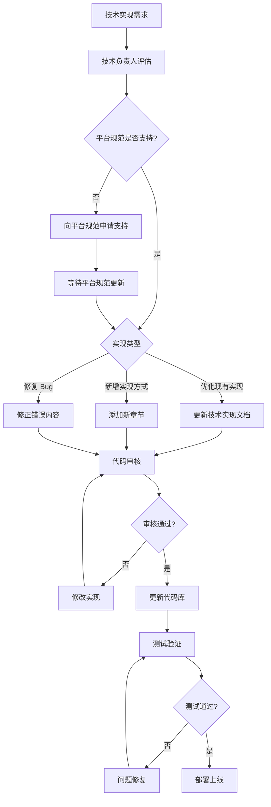
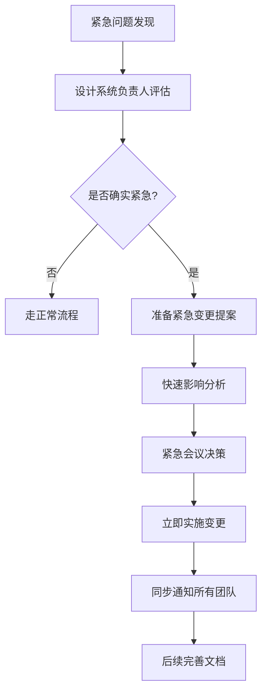

# 设计系统变更工作流

> **文档类型**: 方法论规范
> **版本**: 1.0.0
> **最后更新**: 2025-12-28

## 概述

本文档定义了设计系统不同层次文档的变更工作流程，确保变更的有序传播和影响评估。

## 工作流类型

根据变更发起的层次不同，有三种主要的工作流程：

1. **核心设计系统变更流程**: 自上而下传播
2. **平台应用规范变更流程**: 可能需要向上申请新令牌
3. **技术实现变更流程**: 可能需要向上申请规范支持

## 流程 1: 核心设计系统变更

### 适用场景

- 新增设计令牌（新颜色、新字体、新间距等）
- 修改现有令牌的值
- 废弃旧令牌
- 设计系统架构调整

### 工作流程图



### 详细步骤

#### 步骤 1: 需求评估

**负责人**: 首席设计师/设计系统负责人

**任务**:
- 评估设计需求的必要性
- 判断是否需要修改核心设计系统
- 考虑现有令牌是否可以满足需求

**产出**: 评估报告

---

#### 步骤 2: 准备变更提案

**负责人**: 首席设计师

**任务**:
- 撰写变更提案文档
- 说明变更动机和预期效果
- 提供变更前后对比
- 准备视觉示例

**模板**:
```markdown
# 设计系统变更提案

## 变更摘要
- 变更类型: [新增/修改/废弃]
- 令牌名称: `token.name`
- 变更值: old-value → new-value

## 变更动机
(说明为什么需要这个变更)

## 预期效果
(说明变更后的预期改进)

## 视觉对比
(提供前后对比图)
```

---

#### 步骤 3: 影响范围分析

**负责人**: 首席设计师 + 技术负责人

**任务**:
- 识别受影响的平台和文档
- 评估对现有实现的影响
- 估算实施工作量
- 制定迁移计划

**模板**:
```markdown
## 影响范围分析

### 受影响的平台
- [ ] Mobile (iOS/Android)
- [ ] Web (Desktop/Tablet)
- [ ] Desktop (macOS/Windows/Linux)

### 受影响的文档
- 第二层: mobile-ui-spec.md, web-ui-spec.md
- 第三层: mobile-implementation.md, web-implementation.md

### 代码影响
- 前端: ~50 个组件需要更新
- 移动端: ~30 个 Widget 需要更新

### 工作量估算
- 文档更新: 2 天
- 代码实施: 5 天
- 测试验证: 3 天
- 总计: 10 个工作日
```

---

#### 步骤 4: 沟通与审核

**负责人**: 设计系统负责人

**任务**:
- 与所有平台负责人沟通变更
- 收集反馈和建议
- 调整提案内容
- 提交正式审核

**沟通清单**:
- [ ] 移动端负责人已知情
- [ ] Web 端负责人已知情
- [ ] 后端负责人已知情（如涉及 API）
- [ ] 产品负责人已批准
- [ ] 技术负责人已审核

---

#### 步骤 5: 实施变更

**负责人**: 首席设计师 → 平台负责人 → 开发团队

**执行顺序**:
1. 更新核心设计系统文档
2. 通知所有平台负责人
3. 各平台更新应用规范文档
4. 各平台更新技术实现文档
5. 开发团队实施代码变更
6. 全面测试验证

**时间线示例**:
```
Week 1: 更新核心设计系统文档
Week 2: 更新平台应用规范
Week 3: 更新技术实现文档 + 开始代码实施
Week 4: 完成代码实施 + 测试
Week 5: 部署上线
```

## 流程 2: 平台应用规范变更

### 适用场景

- 平台特定的交互规范调整
- 新增平台特有的设计模式
- 优化现有平台的设计指南

### 工作流程图



### 关键决策点

#### 决策 1: 是否需要新令牌？

**判断标准**:
- ✅ 需要：这是一个全新的设计元素，其他平台未来也可能使用
- ❌ 不需要：只是现有令牌在特定平台的特殊应用方式

**示例**:
```markdown
# 需要新令牌
需求: 新增"警告色"用于警告提示
决策: 向核心系统申请 `semantic.warning` 令牌

# 不需要新令牌
需求: Mobile 端按钮需要圆角
决策: 使用现有 `border.radius.md` 令牌，在平台规范中说明应用方式
```

---

#### 决策 2: 是否与其他平台冲突？

**检查项**:
- 相同语义是否使用不同令牌？
- 是否违反跨平台一致性原则？
- 用户在不同平台是否会感到困惑？

**解决方案**:
- 如冲突：与其他平台负责人协调，统一规范
- 如不冲突：说明平台差异的合理性

## 流程 3: 技术实现变更

### 适用场景

- 技术栈升级或迁移
- 性能优化
- 新增代码示例
- 修复实现 Bug

### 工作流程图



### 关键注意事项

1. **保持与规范一致**: 技术实现必须严格遵循平台应用规范
2. **避免硬编码**: 使用变量/常量引用设计令牌
3. **文档先行**: 先更新技术实现文档，再修改代码
4. **向后兼容**: 考虑现有代码的迁移路径

## 变更通知模板

### 核心系统变更通知

```markdown
主题: [设计系统] 核心令牌变更通知

各位平台负责人，

核心设计系统已更新，请注意以下变更：

## 变更内容
- 令牌: `primary.green`
- 变更: #24D298 → #1FD190
- 原因: 提升可访问性，符合 WCAG 2.1 AA 标准

## 影响范围
- 所有使用主品牌色的组件
- 预计影响: Mobile (~30 widgets), Web (~50 components)

## 行动要求
- [ ] 更新平台应用规范文档 (Due: Week 2)
- [ ] 更新技术实现文档 (Due: Week 3)
- [ ] 实施代码变更 (Due: Week 4)

## 迁移指南
详见: [migration-guide.md](./migration-guide.md)

如有疑问，请联系: @design-system-lead

---
设计系统团队
```

### 平台规范变更通知

```markdown
主题: [Mobile UI] 平台规范更新通知

移动端开发团队，

Mobile 应用规范已更新：

## 变更内容
- 新增: 底部导航栏设计规范
- 令牌使用: `spacing.md`, `primary.green`

## 影响范围
- 导航组件
- 标签栏组件

## 行动要求
- [ ] 查看更新后的规范文档
- [ ] 更新技术实现文档
- [ ] 计划代码实施时间

## 文档链接
- [mobile-ui-spec.md#底部导航](../mobile-ui-spec.md#底部导航)

---
Mobile UX 团队
```

## 紧急变更流程

### 触发条件

- 严重的可访问性问题
- 品牌合规性紧急调整
- 严重影响用户体验的 Bug

### 快速通道流程



### 紧急变更原则

1. **最小化影响**: 只修改必要的部分
2. **快速通知**: 立即通知所有受影响方
3. **记录完整**: 事后补充完整的变更文档
4. **回顾总结**: 分析为何出现紧急情况，改进流程

## 变更审核清单

### 核心系统变更审核

- [ ] 变更动机清晰合理
- [ ] 影响范围分析完整
- [ ] 与现有令牌无冲突
- [ ] 所有平台负责人已知情
- [ ] 迁移计划可行
- [ ] 文档更新完整

### 平台规范变更审核

- [ ] 核心系统已有所需令牌
- [ ] 不与其他平台冲突
- [ ] 使用令牌引用而非硬编码
- [ ] 平台特定性说明清晰
- [ ] 技术实现可行

### 技术实现变更审核

- [ ] 符合平台应用规范
- [ ] 使用变量/常量引用令牌
- [ ] 代码示例清晰可用
- [ ] 向后兼容性考虑
- [ ] 测试覆盖充分

## 参考资料

- [三层文档架构](./layering-system.md)
- [编辑原则与规范](./editing-principles.md)
- [RACI 职责矩阵](../../conventions/raci.md)
- [AI-DDD 工作流](../workflow/ai-ddd-workflow-standards.md)

---

**维护**: Standards Team
**版本**: 1.0.0
