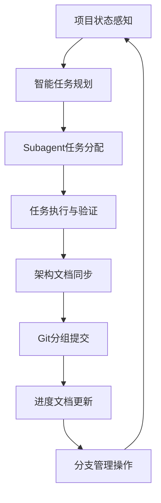

# 七步循环执行模型 (Legacy)

> ⚠️ **DEPRECATED**: 此文档已被十步循环取代。请使用新版本：
> - **推荐**: `standards/core/ten-step-cycle/README.md`
> - **摘要**: `standards/summaries/ten-step-cycle-summary.md`

## 🎯 概述

七步循环是AI驱动开发的核心执行框架，通过标准化的工作流程确保项目开发的系统化、自动化和高质量交付。

> 📌 **迁移说明**: 十步循环扩展了七步循环，增加了:
> - A.0 状态感知 (前置步骤)
> - A.1 Spec管理 (OpenSpec集成)
> - 分支管理和PR流程 (B.1, C.2)
> - Spec归档 (D.2)

## 📊 核心执行框架

### 循环模型



### 执行循环控制逻辑

```yaml
主循环控制:
  while (项目未达到目标状态):
    # Step 1: 状态感知
    current_state = 识别当前项目状态()
    cycle_position = 判断七步循环当前位置()
    
    # Step 2: 任务规划
    if cycle_position == "需要规划":
      task_list = 生成原子化任务清单(current_state)
    
    # Step 3-4: 执行任务
    if cycle_position == "任务执行中":
      for task in task_list:
        if task.status == "pending":
          subagent = 选择合适的Subagent(task)
          result = 执行任务(subagent, task)
          验证任务结果(result)
    
    # Step 5: 架构文档同步
    if cycle_position == "代码完成待文档同步":
      同步架构文档()
      
    # Step 6: Git提交
    if cycle_position == "文档已同步待提交":
      执行Git分组提交()
      
    # Step 7: 进度更新
    if cycle_position == "已提交待进度更新":
      更新进度文档()
```

## 🔍 各步骤详解

1. [项目状态感知](state-recognition.md)
2. [智能任务规划](task-planning.md)
3. [Subagent任务分配](subagent-allocation.md)
4. [任务执行与验证](task-execution.md)
5. [架构文档同步](architecture-sync.md)
6. [Git分组提交](git-commit-strategy.md)
7. [进度文档更新](progress-update.md)

## 💡 使用指南

### 快速开始

1. 确定当前项目状态
2. 应用七步循环判断逻辑
3. 执行对应步骤的操作
4. 验证执行结果
5. 进入下一循环

### 最佳实践

- 严格遵循步骤顺序
- 每步都进行验证
- 保持文档同步
- 及时更新进度

## 📚 相关文档

- [双规范协作体系](../dual-standard-system/README.md)
- [架构文档管理](../architecture-docs/management-system.md)
- [AI工作流协议](../../workflow/ai-workflow-protocol.md)
