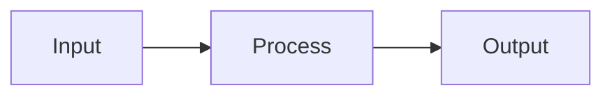

# Design: {Feature Name}

> **Change**: {change-id}
> **Created**: {YYYY-MM-DD}

## Problem Statement

{清晰描述要解决的问题，2-5 句话}

1. **{问题1}**: {描述}
2. **{问题2}**: {描述}
3. **{问题3}**: {描述}

---

## Options Considered

### Option A: {方案名称}

**Description**: {简述方案}

**Pros**:
- {优点1}
- {优点2}

**Cons**:
- {缺点1}
- {缺点2}

**Effort**: {LOW | MEDIUM | HIGH}

### Option B: {方案名称}

**Description**: {简述方案}

**Pros**:
- {优点1}
- {优点2}

**Cons**:
- {缺点1}
- {缺点2}

**Effort**: {LOW | MEDIUM | HIGH}

### Option C: {方案名称} (如需要)

{同上结构}

---

## Decision

**Selected**: Option {X} - {方案名称}

**Rationale**:
{为什么选择这个方案，1-3 句话}

**Trade-offs Accepted**:
- {接受的权衡1}
- {接受的权衡2}

---

## Architecture / Design

### High-Level Design

```
{ASCII 图或描述整体架构}

┌─────────────┐     ┌─────────────┐
│  Component A │ ──▶ │  Component B │
└─────────────┘     └─────────────┘
        │
        ▼
┌─────────────┐
│  Component C │
└─────────────┘
```

### Key Components

| 组件 | 职责 | 位置 |
|------|------|------|
| {组件1} | {职责} | `path/to/component` |
| {组件2} | {职责} | `path/to/component` |

### Data Flow (如适用)



---

## Risks & Mitigations

| 风险 | 可能性 | 影响 | 缓解措施 |
|------|--------|------|---------|
| {风险1} | HIGH/MEDIUM/LOW | HIGH/MEDIUM/LOW | {措施} |
| {风险2} | HIGH/MEDIUM/LOW | HIGH/MEDIUM/LOW | {措施} |

---

## Dependencies

### Internal

- {内部依赖1} - {说明}
- {内部依赖2} - {说明}

### External

- {外部依赖1} - {版本要求}
- {外部依赖2} - {版本要求}

---

## Migration / Rollback (如适用)

### Migration Steps

1. {步骤1}
2. {步骤2}
3. {步骤3}

### Rollback Plan

{如果出问题，如何回滚}

---

## References

- {相关文档1}
- {相关文档2}
- {外部资源}

---

## Template Usage Notes

**何时需要 design.md**:
- 复杂决策需要记录 (多个可选方案)
- 架构级别的变更
- 跨模块的系统设计
- 需要团队 review 的技术决策

**何时可以省略**:
- 简单功能，只需 proposal.md + tasks.md
- 实现方案明确，无需对比选择
- 小型修复或优化

**与 proposal.md 的关系**:
```
proposal.md  →  Why + What (需求层面)
design.md    →  How (技术层面)
tasks.md     →  具体任务分解
```

**图表建议**:
- 简单结构: ASCII 图
- 复杂流程: Mermaid flowchart/sequenceDiagram
- 系统架构: 分层表格 + 连接描述
