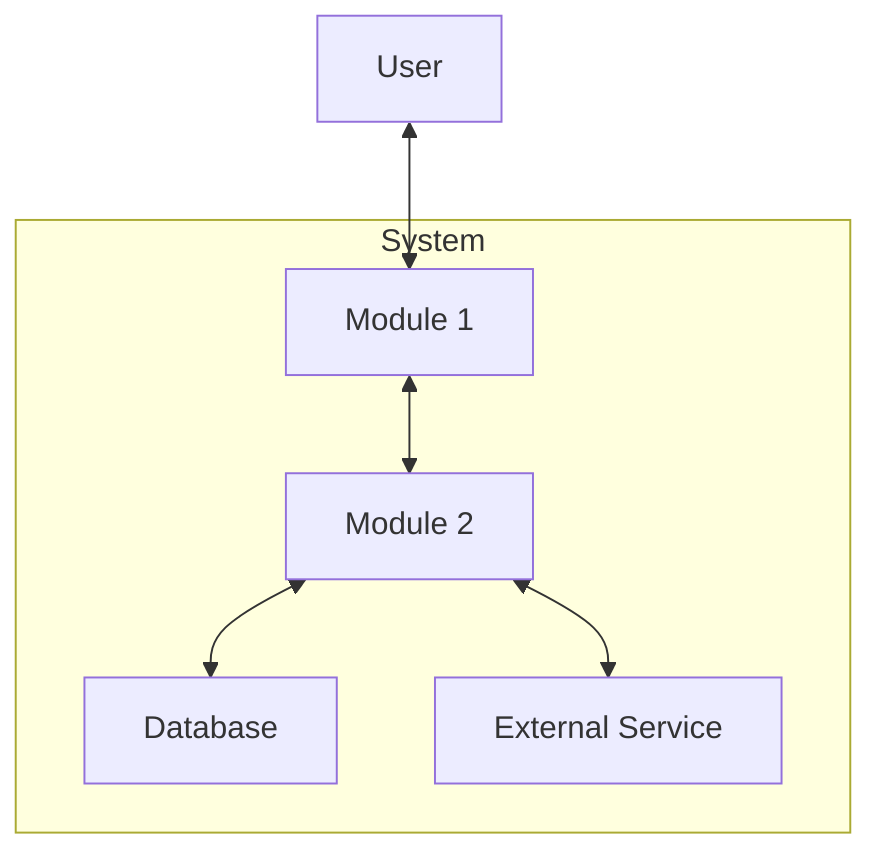

# {Project Name} System Architecture

> **Version**: 0.1.0
> **Status**: Draft
> **Created**: {YYYY-MM-DD}
> **Last Updated**: {YYYY-MM-DD}
> **Parent Document**: `docs/requirements/prd-{project}.md`

---

## 1. Executive Summary

<!--
Purpose: One-page overview for quick understanding
Length: 200-500 words
-->

{Project Name} is a {brief description of the system and its purpose}.

**Core Architecture Pattern**: {e.g., Layered, Microservices, Event-Driven, etc.}

**Key Technology Choices**:
- {Technology 1}: {Brief reason}
- {Technology 2}: {Brief reason}
- {Technology 3}: {Brief reason}

**Module Overview**:
| Module | Purpose |
|--------|---------|
| {Module 1} | {Brief purpose} |
| {Module 2} | {Brief purpose} |
| {Module 3} | {Brief purpose} |

---

## 2. System Overview

### 2.1 System Goals

- {Goal 1}
- {Goal 2}
- {Goal 3}

### 2.2 Constraints

- {Constraint 1}
- {Constraint 2}

### 2.3 Key Stakeholders

| Stakeholder | Role | Concerns |
|-------------|------|----------|
| {Stakeholder 1} | {Role} | {Primary concerns} |
| {Stakeholder 2} | {Role} | {Primary concerns} |

### 2.4 Quality Attributes

| Attribute | Requirement | Priority |
|-----------|-------------|----------|
| Performance | {e.g., Response time < 200ms} | High |
| Security | {e.g., OWASP compliance} | High |
| Scalability | {e.g., Support 10k concurrent users} | Medium |
| Availability | {e.g., 99.9% uptime} | High |

### 2.5 Assumptions and Dependencies

**Assumptions**:
- {Assumption 1}
- {Assumption 2}

**Dependencies**:
- {External dependency 1}
- {External dependency 2}

---

## 3. Architecture Diagram

### 3.1 System Context (C4 Level 1)

```
┌─────────────────────────────────────────────────────────────────┐
│                          {System Name}                           │
├─────────────────────────────────────────────────────────────────┤
│                                                                  │
│    ┌──────────┐         ┌──────────────────┐                    │
│    │   User   │◄───────►│  {System Name}   │                    │
│    └──────────┘         └────────┬─────────┘                    │
│                                  │                               │
│                                  ▼                               │
│                         ┌──────────────────┐                    │
│                         │ External Service │                    │
│                         └──────────────────┘                    │
│                                                                  │
└─────────────────────────────────────────────────────────────────┘
```

### 3.2 Container Diagram (C4 Level 2)

```
┌─────────────────────────────────────────────────────────────────┐
│                          {System Name}                           │
├─────────────────────────────────────────────────────────────────┤
│                                                                  │
│  ┌────────────┐    ┌────────────┐    ┌────────────────────────┐ │
│  │  {Module1} │◄──►│  {Module2} │◄──►│  External Services     │ │
│  │  (Client)  │    │  (Server)  │    │                        │ │
│  └────────────┘    └─────┬──────┘    └────────────────────────┘ │
│        ↑                 │                      ↑               │
│        │                 ▼                      │               │
│        │          ┌────────────┐                │               │
│        │          │  Database  │                │               │
│        │          └────────────┘                │               │
│        └────────────────┴───────────────────────┘               │
│                    Shared Contracts                              │
└─────────────────────────────────────────────────────────────────┘
```

<!-- Alternative: Mermaid diagram

-->

---

## 4. Module Boundaries

### 4.1 Module Responsibility Matrix

| Module | Responsibility | Owns | Uses | Communication |
|--------|----------------|------|------|---------------|
| {Module 1} | {Responsibility} | {What it owns} | {What it uses} | {Protocol} |
| {Module 2} | {Responsibility} | {What it owns} | {What it uses} | {Protocol} |
| {Shared} | {Responsibility} | {What it owns} | - | - |

### 4.2 Boundary Definitions

**{Module 1}**:
- Includes: {Component list}
- Excludes: {What does NOT belong here}
- Entry points: {APIs, events, etc.}

**{Module 2}**:
- Includes: {Component list}
- Excludes: {What does NOT belong here}
- Entry points: {APIs, events, etc.}

### 4.3 Inter-Module Communication

```
{Module 1} ──REST/gRPC──► {Module 2}
{Module 2} ──Events────► {Module 1}
```

---

## 5. Technology Decisions

### TD-001: {Decision Title}

| Aspect | Description |
|--------|-------------|
| **Context** | {Why this decision is needed} |
| **Decision** | {What was decided} |
| **Rationale** | {Why this option was chosen} |
| **Alternatives** | {What alternatives were considered} |
| **Consequences** | {Positive and negative impacts} |
| **Status** | Approved / Pending / Superseded |

### TD-002: {Decision Title}

| Aspect | Description |
|--------|-------------|
| **Context** | {Why this decision is needed} |
| **Decision** | {What was decided} |
| **Rationale** | {Why this option was chosen} |
| **Alternatives** | {What alternatives were considered} |
| **Consequences** | {Positive and negative impacts} |
| **Status** | Approved / Pending / Superseded |

<!-- Add more TDs as needed -->

---

## 6. Cross-Cutting Concerns

### 6.1 Authentication & Authorization

- **Strategy**: {e.g., JWT, OAuth2, Session-based}
- **Implementation**: {Where and how it's enforced}
- **Token management**: {Token lifecycle}

### 6.2 Logging & Monitoring

- **Logging framework**: {e.g., structured logging with JSON}
- **Log levels**: {When to use each level}
- **Monitoring**: {Tools and metrics}
- **Alerting**: {Conditions and channels}

### 6.3 Error Handling

- **Error format**: {Standard error response structure}
- **Error propagation**: {How errors flow through layers}
- **User-facing errors**: {How to present errors to users}

### 6.4 Security

- **Data encryption**: {At rest, in transit}
- **Input validation**: {Where and how}
- **Rate limiting**: {Strategy and thresholds}
- **Audit logging**: {What to audit}

### 6.5 Performance

- **Response time targets**: {SLA definitions}
- **Caching strategy**: {What, where, TTL}
- **Optimization guidelines**: {Key principles}

### 6.6 Deployment Architecture

- **Deployment model**: {e.g., Containerized, Serverless}
- **Environments**: {Dev, Staging, Production}
- **CI/CD pipeline**: {Overview of deployment process}

---

## 7. Data Architecture

### 7.1 Data Stores

| Store | Type | Purpose | Owner |
|-------|------|---------|-------|
| {Store 1} | {e.g., PostgreSQL} | {Purpose} | {Module} |
| {Store 2} | {e.g., Redis} | {Purpose} | {Module} |

### 7.2 Data Flow

```
User Input → {Module 1} → Validation → {Module 2} → Database
                ↓
           Cache Layer
```

### 7.3 Data Ownership

| Data Entity | Owner Module | Access Level for Others |
|-------------|--------------|-------------------------|
| {Entity 1} | {Module} | Read-only via API |
| {Entity 2} | {Module} | No direct access |

### 7.4 Synchronization Strategy

- **Sync approach**: {e.g., Event-sourcing, Polling, Webhooks}
- **Conflict resolution**: {How conflicts are handled}
- **Offline support**: {If applicable}

### 7.5 Privacy and Compliance

- **PII handling**: {How personal data is managed}
- **Data retention**: {Policies and implementation}
- **GDPR/Compliance**: {Relevant compliance requirements}

---

## 8. Integration Patterns

### 8.1 API Patterns

| Pattern | Usage | Location |
|---------|-------|----------|
| REST | {When used} | {Contract location} |
| GraphQL | {When used} | {Contract location} |
| gRPC | {When used} | {Contract location} |

### 8.2 Event-Driven Patterns

| Event Type | Publisher | Subscribers | Purpose |
|------------|-----------|-------------|---------|
| {Event 1} | {Module} | {Modules} | {Purpose} |
| {Event 2} | {Module} | {Modules} | {Purpose} |

### 8.3 Sync vs Async

| Operation | Type | Reason |
|-----------|------|--------|
| {Operation 1} | Sync | {Why synchronous} |
| {Operation 2} | Async | {Why asynchronous} |

### 8.4 Contract Location

```
shared/
└── contracts/
    ├── {resource1}.yaml    # OpenAPI spec
    ├── {resource2}.yaml    # OpenAPI spec
    └── events/
        └── {event}.yaml    # Event schemas
```

---

## 9. Evolution Roadmap

### 9.1 Architecture Phases

| Phase | Focus | Key Changes |
|-------|-------|-------------|
| Phase 1 | {Focus} | {Changes} |
| Phase 2 | {Focus} | {Changes} |
| Phase 3 | {Focus} | {Changes} |
| Phase 4 | {Focus} | {Changes} |

### 9.2 Migration Plans

- **{Migration 1}**: {From → To, Timeline, Strategy}
- **{Migration 2}**: {From → To, Timeline, Strategy}

### 9.3 Scalability Considerations

- **Horizontal scaling**: {When and how}
- **Vertical scaling**: {Limits and thresholds}
- **Bottleneck mitigation**: {Identified bottlenecks and solutions}

---

## 10. Related Documents

| Document | Path | Description |
|----------|------|-------------|
| PRD | `docs/requirements/prd-{project}.md` | Product requirements |
| {Module 1} Architecture | `{module1}/docs/ARCHITECTURE.md` | Module-level design |
| {Module 2} Architecture | `{module2}/docs/ARCHITECTURE.md` | Module-level design |
| API Contracts | `shared/contracts/` | OpenAPI specifications |
| OpenSpec Changes | `openspec/changes/` | Active specifications |

---

## Version History

| Version | Date | Changes | Author |
|---------|------|---------|--------|
| 0.1.0 | {YYYY-MM-DD} | Initial draft | {Author} |

---

## Validation Checklist

Before finalizing this document, verify:

### Structure
- [ ] Version header complete (Version, Status, Created, Parent Document)
- [ ] All 10 required sections present
- [ ] Version history maintained

### Content
- [ ] Executive summary is concise (<500 words)
- [ ] At least one architecture diagram included
- [ ] All modules listed with clear boundaries
- [ ] Technology decisions documented with rationale
- [ ] Cross-cutting concerns addressed

### References
- [ ] Parent PRD exists and is linked
- [ ] Related module architectures linked
- [ ] No broken references
